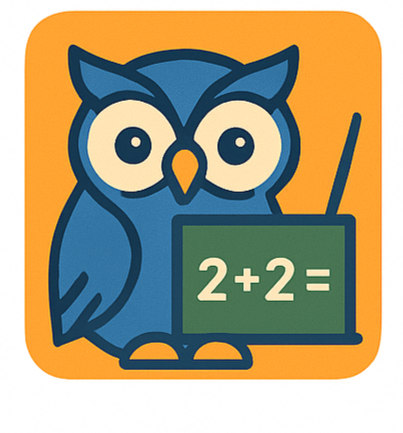
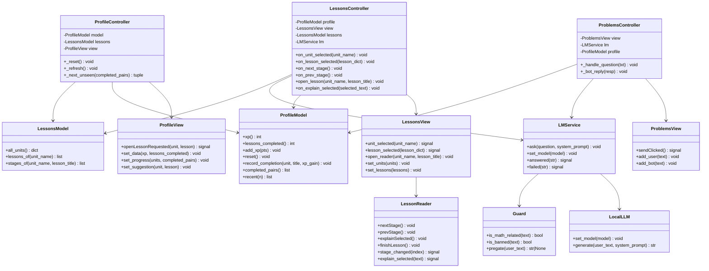
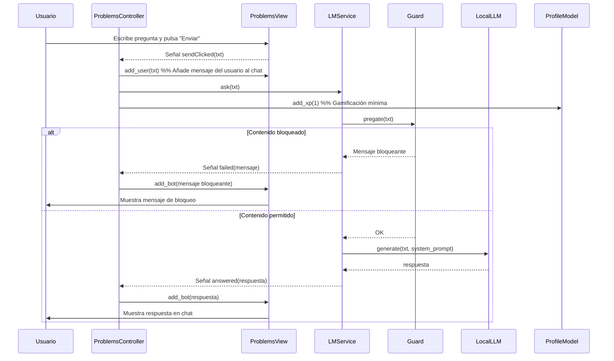
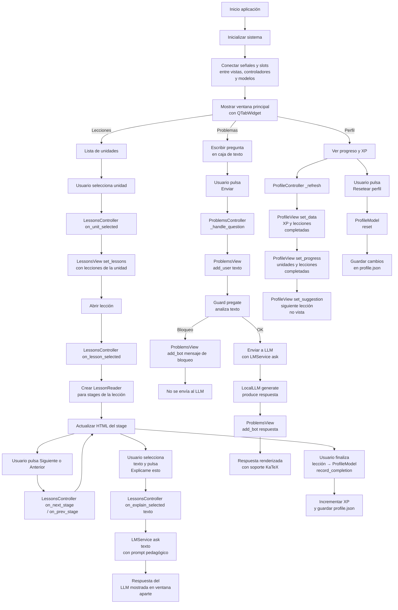

<p align="center">
  
</p>


# Tutor de Matemáticas local

Aplicación de escritorio para apoyar el aprendizaje de matemáticas en español. Renderiza lecciones y ofrece un chat de “Problemas” con un LLM local (Transformers/PyTorch).


## Requisitos
- Python 3.10–3.12
- Ver `requirements.txt` (PySide6, Transformers, Torch, etc.)

## Estructura
- `main.py`: ventana principal y tabs (Lecciones, Problemas, Perfil).
- `models/`: `lessons.py` (lee `data/lessons.json`), `profile.py` (XP y progreso).
- `views/`: `lessons.py`, `problems.py`, `profile.py`.
- `services/`: `lm_service.py` (hilo con LLM), `guard.py` (pre-filtro).
- `tutor_backend.py`: carga del modelo local y `generate()`.
- `ui/style.py`: tema y estilos (Fusion + QSS).
- `assets/`: `chat.html` (KaTeX) y `svg/` (ilustraciones).
- `data/`: `lessons.json` y `profile.json`.

## Modelos locales
Coloca los modelos (carpetas) en el mismo directorio que `tutor_backend.py`:
- `gemma-3-1b-it-sft-dpo/`
- `Qwen3-0.6B-sft-dpo/`

La app no descarga nada; todo es `local_files_only=True`.

Opcionalmente, se puede modificar la aplicación para que cargue directamente los modelos desde Hugging Face, alojados en la cuenta `dpabonc`. No es necesario colocar carpetas de modelos localmente a menos que quieras evitar la descarga.

Modelos utilizados:
- [`dpabonc/gemma-3-1b-it-sft-dpo`](https://huggingface.co/dpabonc/gemma-3-1b-it-sft-dpo)
- [`dpabonc/Qwen3-0.6B-sft-dpo`](https://huggingface.co/dpabonc/Qwen3-0.6B-sft-dpo)

Por defecto, la aplicación configurará `local_files_only=False` en `transformers` para que se descarguen automáticamente si no están en caché local.  Si deseas forzar el uso de copias locales sin conexión, cambia la configuración a `local_files_only=True` en `tutor_backend.py`.

### Ejemplo de carga en `tutor_backend.py`:

```python
from transformers import pipeline

# Ejemplo con Gemma
model_id = "dpabonc/gemma-3-1b-it-sft-dpo"
pipe = pipeline(
    "text-generation",
    model=model_id,
    device_map="auto",
    local_files_only=False  # Cambia a True si solo quieres usar modelos ya descargados
)
```

## Ejecutar
```bash
python -m venv .venv
# Windows: .venv\Scripts\activate
# macOS/Linux: source .venv/bin/activate
pip install -r requirements.txt
python main.py
```

## Diagramas

A continuación se presentan diagramas que describen la arquitectura de clases, la secuencia de eventos en el chat de “Problemas” y el flujo de usabilidad general.

---

### Diagrama de clases


### Secuencia: pregunta en “Problemas”



### Flujo de usabilidad




## Empaquetado con PyInstaller

```
pyinstaller ^
  --name TutorMate ^
  --noconfirm ^
  --windowed ^
  --add-data "assets;assets" ^
  --add-data "data;data" ^
  --hidden-import PySide6.QtWebEngineCore ^
  --hidden-import PySide6.QtWebEngineWidgets ^
  --hidden-import PySide6.QtWebChannel ^
  --hidden-import PySide6.QtSvgWidgets ^
  main.py
```