# Mi cuaderno — Documentación técnica

> **Aplicación de escritorio Electron + Ollama** para tutorías matemáticas adaptativas con un motor multi-agente CLASS-A, recuperación RAG y persistencia local completa. Diseñada para alumnos de primaria/secundaria.

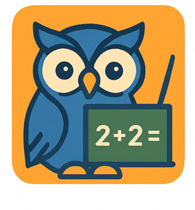

---

## Índice

1. [Arranque rápido](#arranque-rápido)
2. [Arquitectura general](#arquitectura-general)
3. [UI — Interfaz de usuario](#ui--interfaz-de-usuario)
4. [Agentic AI — Pipeline multi-agente CLASS-A](#agentic-ai--pipeline-multi-agente-class-a)
5. [RAG — Recuperación aumentada por generación](#rag--recuperación-aumentada-por-generación)
6. [Optimización](#optimización)
7. [Datos y persistencia](#datos-y-persistencia)
8. [Tests](#tests)
9. [Mejoras posibles](#mejoras-posibles)

---

## Arranque rápido

```bash
# 1. Instalar dependencias
npm install

# 2. Ollama debe estar corriendo con al menos un modelo
ollama serve
ollama pull qwen3:0.6b   # recomendado: modelo rápido para el router
ollama pull gemma3:4b    # recomendado: modelo tutor con razonamiento

# 3. Lanzar la app
npm run dev

# Tests
npm test
```

---

## Arquitectura general

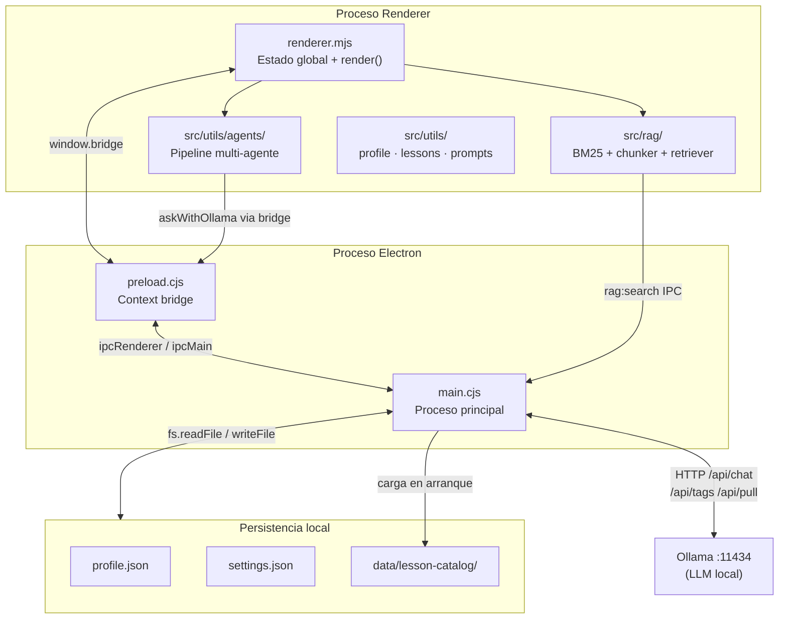
```mermaid
graph TD
    subgraph Electron["Proceso Electron"]
        MAIN["main.cjs\nProceso principal"]
        PRELOAD["preload.cjs\nContext bridge"]
    end

    subgraph Renderer["Proceso Renderer"]
        REND["renderer.mjs\nEstado global + render()"]
        AGENTS["src/utils/agents/\nPipeline multi-agente"]
        RAG_MOD["src/rag/\nBM25 + chunker + retriever"]
        UTILS["src/utils/\nprofile · lessons · prompts"]
    end

    subgraph Storage["Persistencia local"]
        PROFILE["profile.json"]
        SETTINGS["settings.json"]
        CATALOG["data/lesson-catalog/"]
    end

    OLLAMA["Ollama :11434\n(LLM local)"]

    REND <-->|window.bridge| PRELOAD
    PRELOAD <-->|ipcRenderer / ipcMain| MAIN
    MAIN <-->|HTTP /api/chat\n/api/tags /api/pull| OLLAMA
    MAIN <-->|fs.readFile / writeFile| Storage
    MAIN -->|carga en arranque| CATALOG
    REND --> AGENTS
    REND --> RAG_MOD
    AGENTS -->|askWithOllama via bridge| PRELOAD
    RAG_MOD -->|rag:search IPC| MAIN
```

### Secuencia de arranque

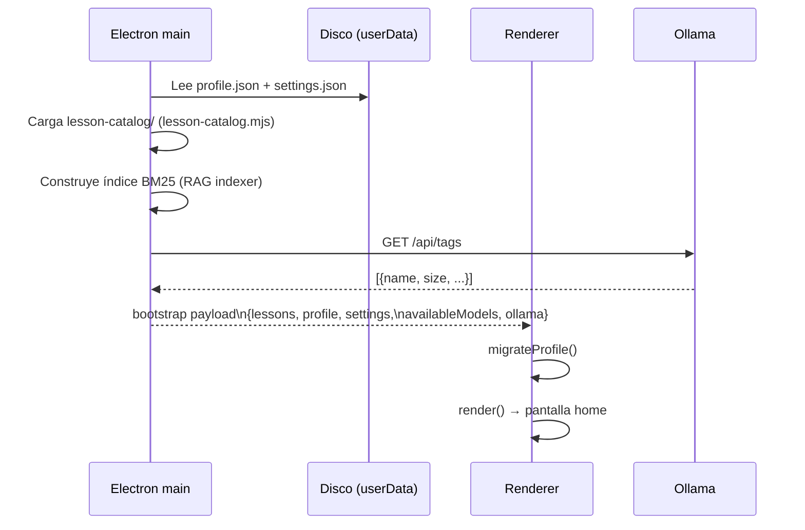
```mermaid
sequenceDiagram
    participant E as Electron main
    participant FS as Disco (userData)
    participant R as Renderer
    participant O as Ollama

    E->>FS: Lee profile.json + settings.json
    E->>E: Carga lesson-catalog/ (lesson-catalog.mjs)
    E->>E: Construye índice BM25 (RAG indexer)
    E->>O: GET /api/tags
    O-->>E: [{name, size, ...}]
    E-->>R: bootstrap payload\n{lessons, profile, settings,\navailableModels, ollama}
    R->>R: migrateProfile()
    R->>R: render() → pantalla home
```

---

## UI — Interfaz de usuario

### Demos

| Lecciones | Explicación contextual |
|---|---|
|  | 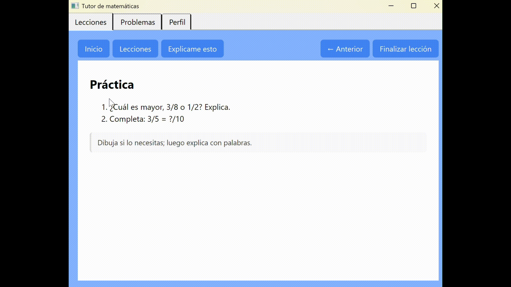 |

| Ejercicio guiado | Perfil y progreso |
|---|---|
| 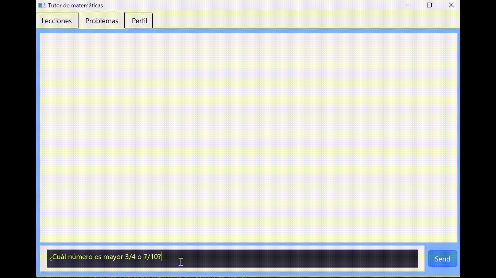 |  |

### El cuaderno como metáfora de navegación

La aplicación organiza todo el contenido como un **cuaderno físico**. En la pantalla de inicio aparece cerrado; al pulsarlo se abre mostrando las páginas interiores con pestañas.

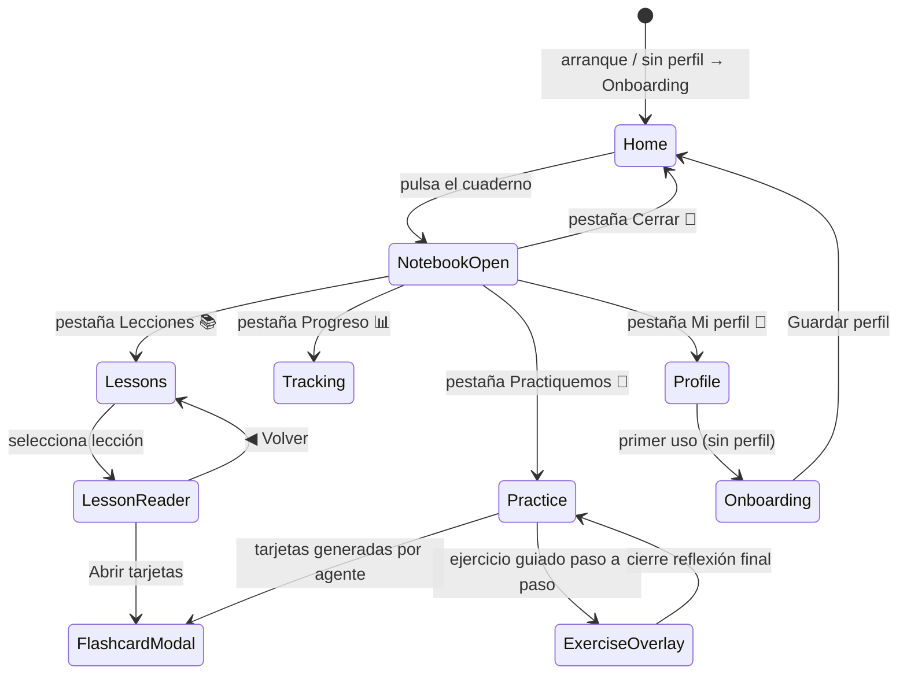
```mermaid
stateDiagram-v2
    [*] --> Home : arranque / sin perfil → Onboarding
    Home --> NotebookOpen : pulsa el cuaderno
    NotebookOpen --> Lessons : pestaña Lecciones 📚
    NotebookOpen --> Practice : pestaña Practiquemos 🧠
    NotebookOpen --> Tracking : pestaña Progreso 📊
    NotebookOpen --> Profile : pestaña Mi perfil 👤
    NotebookOpen --> Home : pestaña Cerrar 📕
    Lessons --> LessonReader : selecciona lección
    LessonReader --> Lessons : ◀ Volver
    LessonReader --> FlashcardModal : Abrir tarjetas
    Practice --> FlashcardModal : tarjetas generadas por agente
    Practice --> ExerciseOverlay : ejercicio guiado paso a paso
    ExerciseOverlay --> Practice : cierre reflexión final
    Profile --> Onboarding : primer uso (sin perfil)
    Onboarding --> Home : Guardar perfil
```

### Jerarquía de componentes

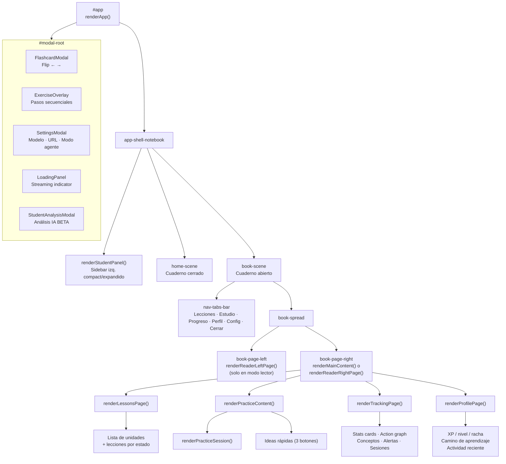
```mermaid
graph TD
    APP["#app\nrenderApp()"]

    APP --> SHELL["app-shell-notebook"]
    SHELL --> PANEL["renderStudentPanel()\nSidebar izq. compact/expandido"]
    SHELL --> HOME_SCENE["home-scene\nCuaderno cerrado"]
    SHELL --> BOOK_SCENE["book-scene\nCuaderno abierto"]

    BOOK_SCENE --> NAV["nav-tabs-bar\nLecciones · Estudio · Progreso · Perfil · Config · Cerrar"]
    BOOK_SCENE --> SPREAD["book-spread"]
    SPREAD --> LEFT["book-page-left\nrenderReaderLeftPage()\n(solo en modo lector)"]
    SPREAD --> RIGHT["book-page-right\nrenderMainContent() o\nrenderReaderRightPage()"]

    RIGHT --> LP["renderLessonsPage()"]
    RIGHT --> PP["renderPracticeContent()"]
    RIGHT --> TP["renderTrackingPage()"]
    RIGHT --> PROF["renderProfilePage()"]

    LP --> UNITS["Lista de unidades\n+ lecciones por estado"]
    PP --> SESSION["renderPracticeSession()"]
    PP --> PROMPTS["Ideas rápidas (3 botones)"]
    TP --> STATS["Stats cards · Action graph\nConceptos · Alertas · Sesiones"]
    PROF --> XP["XP / nivel / racha\nCamino de aprendizaje\nActividad reciente"]

    subgraph Modals["#modal-root"]
        FC["FlashcardModal\nFlip ← →"]
        EX["ExerciseOverlay\nPasos secuenciales"]
        SET["SettingsModal\nModelo · URL · Modo agente"]
        LOAD["LoadingPanel\nStreaming indicator"]
        ANAL["StudentAnalysisModal\nAnálisis IA BETA"]
    end

    APP --> Modals
```

### Gestión de estado (sin framework)

No hay React, Vue ni Svelte. El estado vive en un único objeto global y cualquier cambio llama a `render()`, que regenera el `innerHTML` completo del `#app`.


```mermaid
graph LR
    subgraph state["state (objeto global en renderer.mjs)"]
        lessons
        profile
        settings
        page
        practiceSession
        flashcards
        exerciseOverlay
        lessonUi
        loadingPanel
        studentPanel
        ollama
        studentAnalysis
    end

    DOM_EVENT["Evento DOM\nclick / input / submit / dragstart"] --> HANDLER["handleClick()\nhandleInput()\nhandleSubmit()\nhandleDrop()"]
    HANDLER --> state
    state --> RENDER["render()\nRegeneración completa del DOM"]
```

### Lector de lecciones — overlay de visión y recorte

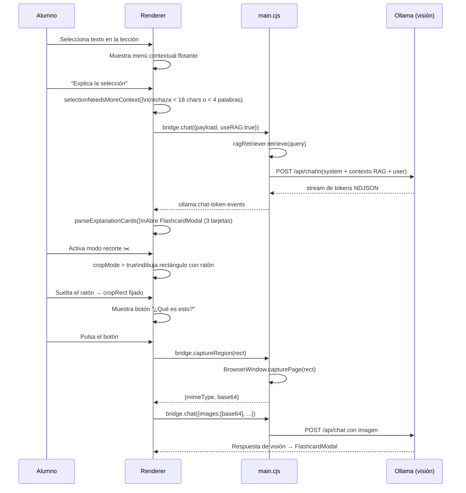
```mermaid
sequenceDiagram
    participant U as Alumno
    participant R as Renderer
    participant M as main.cjs
    participant O as Ollama (visión)

    U->>R: Selecciona texto en la lección
    R->>R: Muestra menú contextual flotante
    U->>R: "Explica la selección"
    R->>R: selectionNeedsMoreContext()\n(rechaza < 18 chars o < 4 palabras)
    R->>M: bridge.chat({payload, useRAG:true})
    M->>M: ragRetriever.retrieve(query)
    M->>O: POST /api/chat\n(system + contexto RAG + user)
    O-->>M: stream de tokens NDJSON
    M-->>R: ollama:chat-token events
    R->>R: parseExplanationCards()\nAbre FlashcardModal (3 tarjetas)

    U->>R: Activa modo recorte ✂️
    R->>R: cropMode = true\ndibuja rectángulo con ratón
    U->>R: Suelta el ratón → cropRect fijado
    R->>R: Muestra botón "¿Qué es esto?"
    U->>R: Pulsa el botón
    R->>M: bridge.captureRegion(rect)
    M->>M: BrowserWindow.capturePage(rect)
    M-->>R: {mimeType, base64}
    R->>M: bridge.chat({images:[base64], ...})
    M->>O: POST /api/chat con imagen
    O-->>R: Respuesta de visión → FlashcardModal
```

### Sistema de flashcards

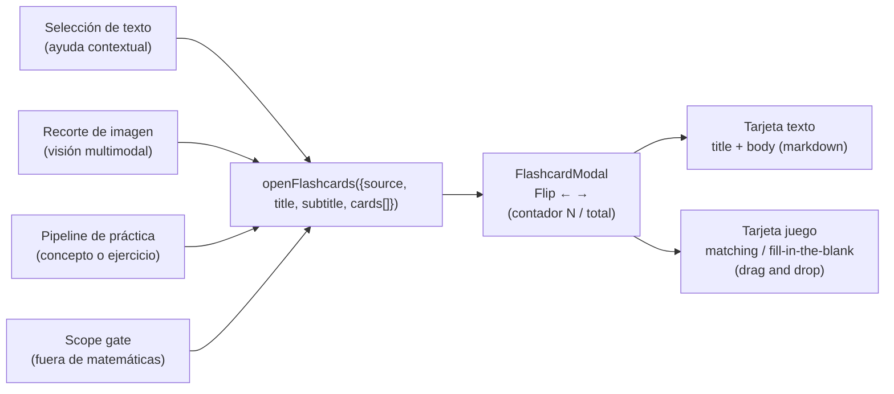
```mermaid
flowchart LR
    SRC1["Selección de texto\n(ayuda contextual)"]
    SRC2["Recorte de imagen\n(visión multimodal)"]
    SRC3["Pipeline de práctica\n(concepto o ejercicio)"]
    SCOPE["Scope gate\n(fuera de matemáticas)"]

    SRC1 & SRC2 & SRC3 & SCOPE --> OPEN["openFlashcards({source, title, subtitle, cards[]})"]
    OPEN --> MODAL["FlashcardModal\nFlip ← →\n(contador N / total)"]

    MODAL --> CT["Tarjeta texto\ntitle + body (markdown)"]
    MODAL --> CG["Tarjeta juego\nmatching / fill-in-the-blank\n(drag and drop)"]
```

### Overlay de ejercicio guiado

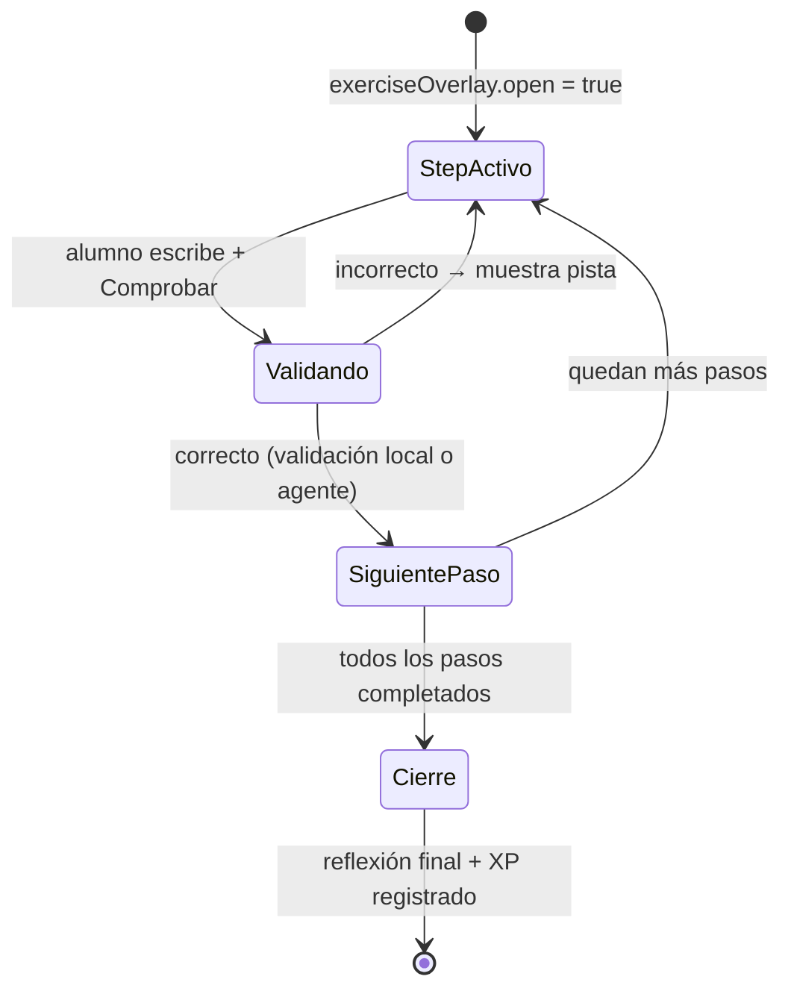
```mermaid
stateDiagram-v2
    [*] --> StepActivo : exerciseOverlay.open = true
    StepActivo --> Validando : alumno escribe + Comprobar
    Validando --> StepActivo : incorrecto → muestra pista
    Validando --> SiguientePaso : correcto (validación local o agente)
    SiguientePaso --> StepActivo : quedan más pasos
    SiguientePaso --> Cierre : todos los pasos completados
    Cierre --> [*] : reflexión final + XP registrado
```

La validación del paso funciona en dos niveles:
1. **Evaluador cliente** (`evaluateStepAnswer`): normaliza acentos, stopwords y solapamiento de tokens (≥ 60 %) sin llamar al LLM.
2. **Agente pedagógico**: si el evaluador cliente no es concluyente, el turno se envía al `runTurnPipeline`.

### Extensibilidad multi-cuaderno

La constante `CUADERNOS` en `renderer.mjs` está lista para soportar materias adicionales:

```javascript
// Para añadir una nueva materia, basta con agregar una entrada:
const CUADERNOS = [
  {
    id: "mates",
    labelHtml: "Mi Cuaderno<br>de Mates",
    subject: "matematicas",
    page: "lessons",
    stickers: ["⭐", "📐", "🔢", "📏"]
  }
  // Próximamente:
  // { id: "lengua", labelHtml: "Mi Cuaderno<br>de Lengua", subject: "lengua", ... }
];
```

Cada cuaderno necesitaría su propio catálogo de lecciones, un scope en el router y opcionalmente un prompt de sistema especializado.

---

## Agentic AI — Pipeline multi-agente CLASS-A

### Visión general

El sistema está inspirado en el modelo de tutoría **CLASS** (Classroom Assessment Scoring System): scaffolding instructivo, retroalimentación correctiva calibrada y presencia emocional cercana. Cada pregunta del alumno atraviesa hasta 7 agentes especializados en tres pipelines orquestados.

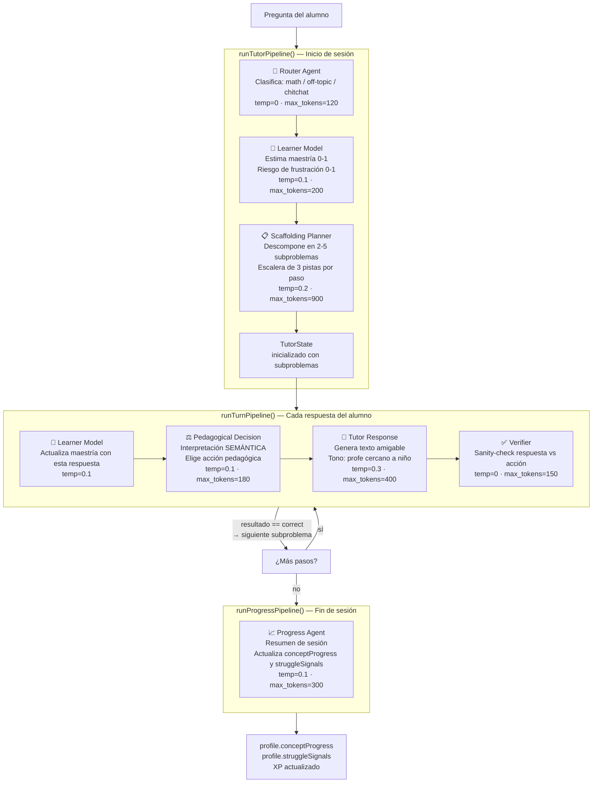
```mermaid
graph TD
    Q["Pregunta del alumno"]

    subgraph SESSION["runTutorPipeline() — Inicio de sesión"]
        R_AG["🔀 Router Agent\nClasifica: math / off-topic / chitchat\ntemp=0 · max_tokens=120"]
        LM1["🧠 Learner Model\nEstima maestría 0-1\nRiesgo de frustración 0-1\ntemp=0.1 · max_tokens=200"]
        SP["📋 Scaffolding Planner\nDescompone en 2-5 subproblemas\nEscalera de 3 pistas por paso\ntemp=0.2 · max_tokens=900"]
        TS["TutorState\ninicializado con subproblemas"]
        R_AG --> LM1 --> SP --> TS
    end

    subgraph TURN["runTurnPipeline() — Cada respuesta del alumno"]
        LM2["🧠 Learner Model\nActualiza maestría con esta respuesta\ntemp=0.1"]
        PD["⚖️ Pedagogical Decision\nInterpretación SEMÁNTICA\nElige acción pedagógica\ntemp=0.1 · max_tokens=180"]
        TR["💬 Tutor Response\nGenera texto amigable\nTono: profe cercano a niño\ntemp=0.3 · max_tokens=400"]
        VR["✅ Verifier\nSanity-check respuesta vs acción\ntemp=0 · max_tokens=150"]
        LM2 --> PD --> TR --> VR
    end

    subgraph PROGRESS["runProgressPipeline() — Fin de sesión"]
        PA["📈 Progress Agent\nResumen de sesión\nActualiza conceptProgress y struggleSignals\ntemp=0.1 · max_tokens=300"]
    end

    Q --> SESSION
    TS --> TURN
    TURN -->|"resultado == correct\n→ siguiente subproblema"| NEXT["¿Más pasos?"]
    NEXT -->|sí| TURN
    NEXT -->|no| PROGRESS
    PROGRESS --> PROFILE_UPD["profile.conceptProgress\nprofile.struggleSignals\nXP actualizado"]
```

### Router Agent

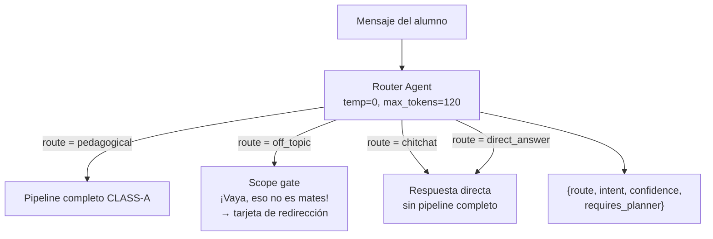
```mermaid
flowchart TD
    Q2["Mensaje del alumno"] --> ROUTER["Router Agent\ntemp=0, max_tokens=120"]
    ROUTER -->|"route = pedagogical"| FULL["Pipeline completo CLASS-A"]
    ROUTER -->|"route = off_topic"| GATE["Scope gate\n¡Vaya, eso no es mates!\n→ tarjeta de redirección"]
    ROUTER -->|"route = chitchat"| DIRECT["Respuesta directa\nsin pipeline completo"]
    ROUTER -->|"route = direct_answer"| DIRECT

    OUT["{route, intent, confidence,\nrequires_planner}"]
    ROUTER --> OUT
```

**Dominio aceptado:** aritmética, álgebra, geometría, fracciones, decimales, porcentajes, medidas, estadística, primos, divisibilidad.

### Learner Model Agent

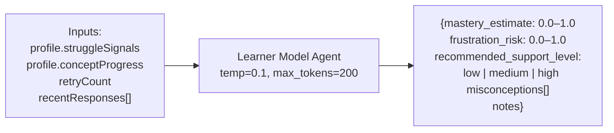
```mermaid
flowchart LR
    IN["Inputs:\nprofile.struggleSignals\nprofile.conceptProgress\nretryCount\nrecentResponses[]"]
    IN --> LM["Learner Model Agent\ntemp=0.1, max_tokens=200"]
    LM --> OUT2["{mastery_estimate: 0.0–1.0\nfrustration_risk: 0.0–1.0\nrecommended_support_level:\n  low | medium | high\nmisconceptions[]\nnotes}"]
```

- `frustration_risk > 0.7` → el planificador puede revelar la solución sin esperar al 3.er intento
- `mastery_estimate > 0.8` → preguntas más abiertas y menos scaffolding

### Scaffolding Planner — Estrategia CLASS

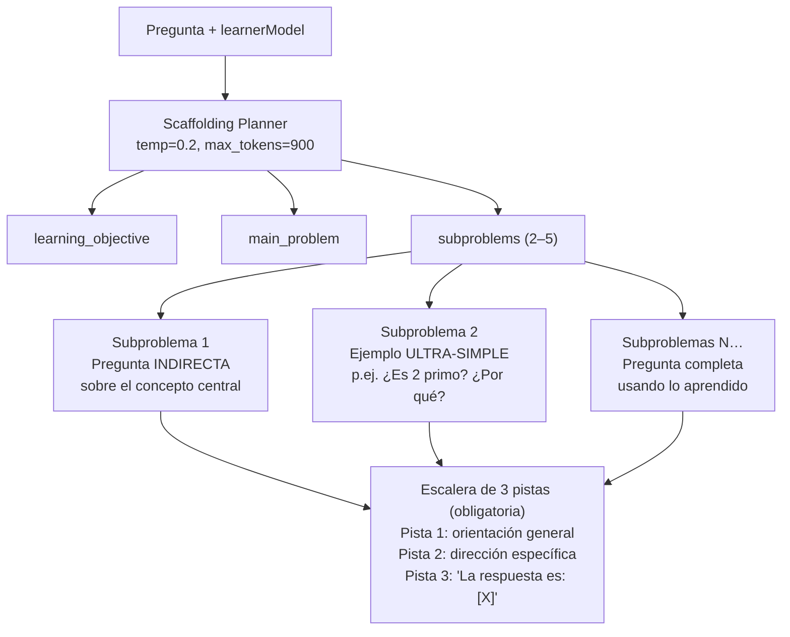
```mermaid
flowchart TD
    Q3["Pregunta + learnerModel"] --> PLAN["Scaffolding Planner\ntemp=0.2, max_tokens=900"]

    PLAN --> OBJ["learning_objective"]
    PLAN --> PROB["main_problem"]
    PLAN --> SUB["subproblems (2–5)"]

    SUB --> S1["Subproblema 1\nPregunta INDIRECTA\nsobre el concepto central"]
    SUB --> S2["Subproblema 2\nEjemplo ULTRA-SIMPLE\np.ej. ¿Es 2 primo? ¿Por qué?"]
    SUB --> SN["Subproblemas N…\nPregunta completa\nusando lo aprendido"]

    S1 & S2 & SN --> HINTS["Escalera de 3 pistas (obligatoria)\nPista 1: orientación general\nPista 2: dirección específica\nPista 3: 'La respuesta es: [X]'"]
```

**Regla de oro:** la Pista 3 siempre es la solución completa. Así el alumno nunca queda bloqueado.

### Pedagogical Decision Agent — Interpretación semántica

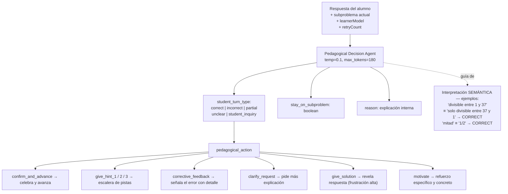
```mermaid
flowchart TD
    ANS["Respuesta del alumno\n+ subproblema actual\n+ learnerModel\n+ retryCount"]
    ANS --> PDA["Pedagogical Decision Agent\ntemp=0.1, max_tokens=180"]

    PDA --> TYPE["student_turn_type:\ncorrect | incorrect | partial\nunclear | student_inquiry"]
    TYPE --> ACTION["pedagogical_action"]

    ACTION --> A1["confirm_and_advance → celebra y avanza"]
    ACTION --> A2["give_hint_1 / 2 / 3 → escalera de pistas"]
    ACTION --> A3["corrective_feedback → señala el error con detalle"]
    ACTION --> A4["clarify_request → pide más explicación"]
    ACTION --> A5["give_solution → revela respuesta (frustración alta)"]
    ACTION --> A6["motivate → refuerzo específico y concreto"]

    PDA --> STAY["stay_on_subproblem: boolean"]
    PDA --> REASON["reason: explicación interna"]

    NOTE["Interpretación SEMÁNTICA — ejemplos:\n'divisible entre 1 y 37'\n≡ 'solo divisible entre 37 y 1' → CORRECT\n'mitad' ≡ '1/2' → CORRECT"]
    PDA -.->|guía de| NOTE
```

**Política de reintentos:**
- 0–1 fallos → `give_hint_1`
- 2+ fallos → `give_solution` (avance automático para no bloquear al alumno)

### Tutor Response + Verifier

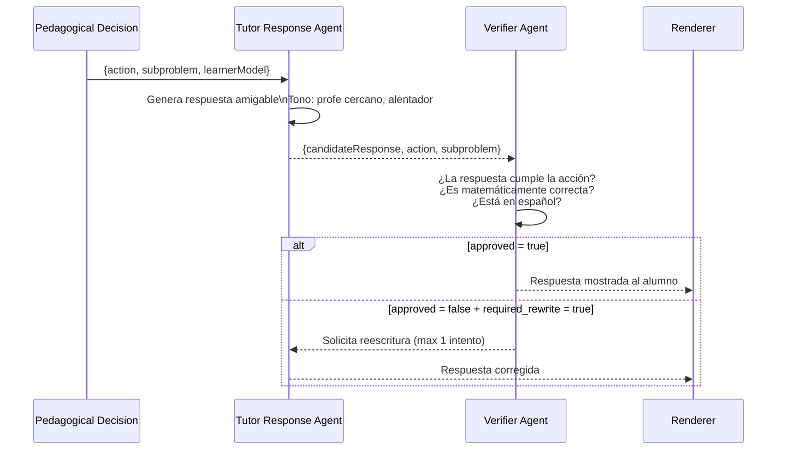
```mermaid
sequenceDiagram
    participant PD as Pedagogical Decision
    participant TR as Tutor Response Agent
    participant VR as Verifier Agent
    participant UI as Renderer

    PD->>TR: {action, subproblem, learnerModel}
    TR->>TR: Genera respuesta amigable\nTono: profe cercano, alentador
    TR-->>VR: {candidateResponse, action, subproblem}
    VR->>VR: ¿La respuesta cumple la acción?<br>¿Es matemáticamente correcta?<br>¿Está en español?
    alt approved = true
        VR-->>UI: Respuesta mostrada al alumno
    else approved = false + required_rewrite = true
        VR-->>TR: Solicita reescritura (max 1 intento)
        TR-->>UI: Respuesta corregida
    end
```

### TutorState — Estructura de sesión

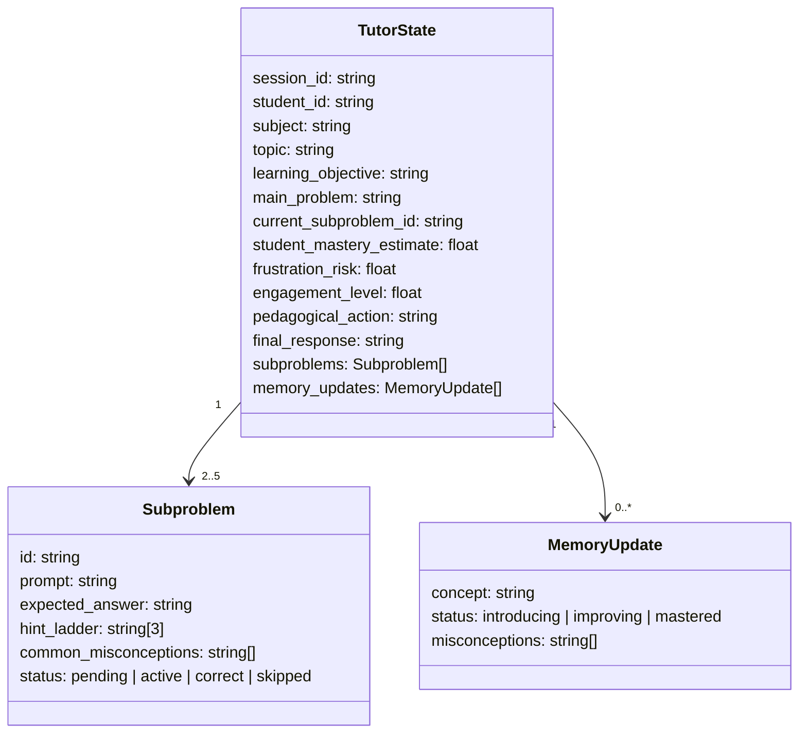
```mermaid
classDiagram
    class TutorState {
        session_id: string
        student_id: string
        subject: string
        topic: string
        learning_objective: string
        main_problem: string
        current_subproblem_id: string
        student_mastery_estimate: float
        frustration_risk: float
        engagement_level: float
        pedagogical_action: string
        final_response: string
        subproblems: Subproblem[]
        memory_updates: MemoryUpdate[]
    }

    class Subproblem {
        id: string
        prompt: string
        expected_answer: string
        hint_ladder: string[3]
        common_misconceptions: string[]
        status: pending | active | correct | skipped
    }

    class MemoryUpdate {
        concept: string
        status: introducing | improving | mastered
        misconceptions: string[]
    }

    TutorState "1" --> "2..5" Subproblem
    TutorState "1" --> "0..*" MemoryUpdate
```

### Model config y presupuestos de tokens

| Agente | Temperatura | max_tokens | Rol |
|---|---|---|---|
| Router | 0.0 | 120 | Clasificador determinista |
| Learner Model | 0.1 | 200 | Estimador de maestría |
| Scaffolding Planner | 0.2 | 900 | Creador de subproblemas |
| Pedagogical Decision | 0.1 | 180 | Decisor de acción |
| Tutor Response | 0.3 | 400 | Generador de texto al alumno |
| Verifier | 0.0 | 150 | Sanity-check final |
| Progress Agent | 0.1 | 300 | Resumen y memoria de sesión |

Los modelos por agente se configuran en **Ajustes → Modo avanzado**:
- **Modelo rápido** (router, verifier): recomendado `qwen3:0.6b`
- **Modelo tutor** (planner, pedagogical, response): recomendado `gemma3:4b`

---

## RAG — Recuperación aumentada por generación

### Arquitectura

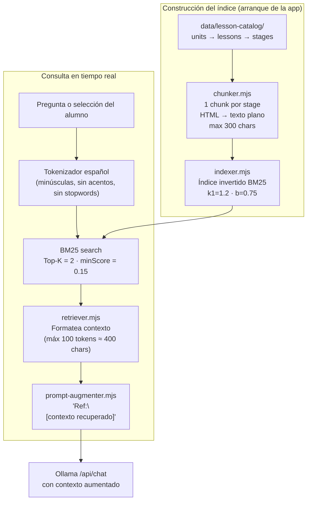
```mermaid
graph TD
    subgraph BUILD["Construcción del índice (arranque de la app)"]
        CATALOG2["data/lesson-catalog/\nunits → lessons → stages"]
        CHUNKER["chunker.mjs\n1 chunk por stage\nHTML → texto plano\nmax 300 chars"]
        INDEXER["indexer.mjs\nÍndice invertido BM25\nk1=1.2 · b=0.75"]
        CATALOG2 --> CHUNKER --> INDEXER
    end

    subgraph QUERY["Consulta en tiempo real"]
        Q4["Pregunta o selección del alumno"]
        TOKENIZE["Tokenizador español\n(minúsculas, sin acentos, sin stopwords)"]
        BM25_S["BM25 search\nTop-K = 2 · minScore = 0.15"]
        RETRIEVER["retriever.mjs\nFormatea contexto\n(máx 100 tokens ≈ 400 chars)"]
        AUGMENT["prompt-augmenter.mjs\n'Ref:\\n[contexto recuperado]'"]

        Q4 --> TOKENIZE --> BM25_S
        INDEXER --> BM25_S
        BM25_S --> RETRIEVER --> AUGMENT
    end

    AUGMENT --> OLLAMA3["Ollama /api/chat\ncon contexto aumentado"]
```

### Pipeline de chunking

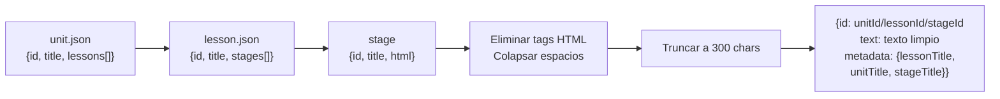
```mermaid
flowchart LR
    UNIT2["unit.json\n{id, title, lessons[]}"]
    LESSON2["lesson.json\n{id, title, stages[]}"]
    STAGE2["stage\n{id, title, html}"]

    UNIT2 --> LESSON2 --> STAGE2

    STAGE2 --> STRIP["Eliminar tags HTML\nColapsar espacios"]
    STRIP --> TRUNC2["Truncar a 300 chars"]
    TRUNC2 --> CHUNK["{id: unitId/lessonId/stageId\ntext: texto limpio\nmetadata: {lessonTitle,\n  unitTitle, stageTitle}}"]
```

### BM25 — Funcionamiento del índice

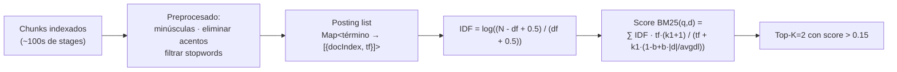
```mermaid
graph LR
    DOCS2["Chunks indexados\n(~100s de stages)"] --> PREPROC2["Preprocesado:\nminúsculas · eliminar acentos\nfiltrar stopwords"]
    PREPROC2 --> POSTING2["Posting list\nMap&lt;término → [{docIndex, tf}]&gt;"]
    POSTING2 --> IDF2["IDF = log((N - df + 0.5) / (df + 0.5))"]
    IDF2 --> SCORE["Score BM25(q,d) =\n∑ IDF · tf·(k1+1) / (tf + k1·(1-b+b·|d|/avgdl))"]
    SCORE --> TOPK["Top-K=2 con score > 0.15"]
```

### Integración RAG ↔ chat en tiempo real

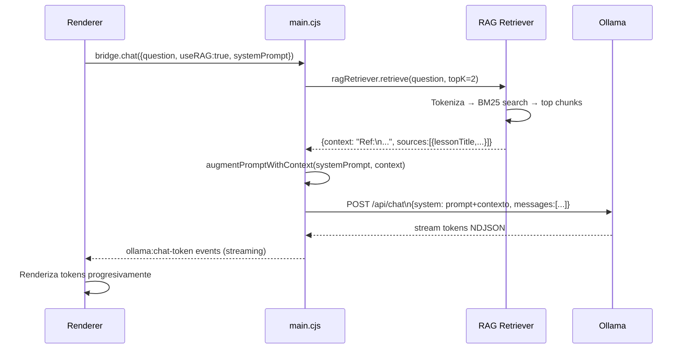
```mermaid
sequenceDiagram
    participant R as Renderer
    participant M as main.cjs
    participant RAG as RAG Retriever
    participant O as Ollama

    R->>M: bridge.chat({question, useRAG:true, systemPrompt})
    M->>RAG: ragRetriever.retrieve(question, topK=2)
    RAG->>RAG: Tokeniza → BM25 search → top chunks
    RAG-->>M: {context: "Ref:\n...", sources:[{lessonTitle,...}]}
    M->>M: augmentPromptWithContext(systemPrompt, context)
    M->>O: POST /api/chat\n{system: prompt+contexto, messages:[...]}
    O-->>M: stream tokens NDJSON
    M-->>R: ollama:chat-token events (streaming)
    R->>R: Renderiza tokens progresivamente
```

### Configuración RAG

| Parámetro | Valor | Razón |
|---|---|---|
| `topK` | 2 | Mínimo latencia, contexto focalizado |
| `minScore` | 0.15 | Filtro agresivo para evitar ruido |
| `maxChunkLength` | 300 chars | Un stage = una idea |
| `contextMaxTokens` | 100 tokens | No satura la ventana del LLM pequeño |
| Stopwords | ~30 palabras ES | Mejora precisión BM25 en español |

---

## Optimización

### Modelos fine-tuned (checkpoints)

Los directorios `Qwen3-0.6B-sft-dpo/` y `gemma-3-1b-it-sft-dpo/` contienen modelos entrenados con SFT + DPO en formato HuggingFace. **No están activos en la app actual** (que usa Ollama). Son artefactos del proceso de entrenamiento:

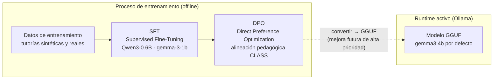
```mermaid
graph LR
    subgraph Training["Proceso de entrenamiento (offline)"]
        DATA2["Datos de entrenamiento\ntutorías sintéticas y reales"]
        SFT["SFT\nSupervised Fine-Tuning\nQwen3-0.6B · gemma-3-1b"]
        DPO["DPO\nDirect Preference Optimization\nalineación pedagógica CLASS"]
        DATA2 --> SFT --> DPO
    end

    subgraph Runtime["Runtime activo (Ollama)"]
        GGUF["Modelo GGUF\ngemma3:4b por defecto"]
    end

    DPO -.->|"convertir → GGUF\n(mejora futura de alta prioridad)"| GGUF
```

### Parámetros de inferencia Ollama

| Parámetro | Valor | Efecto |
|---|---|---|
| `num_ctx` | 1024 | Ventana mínima → menor RAM y latencia |
| `num_predict` | 1024 | Límite de tokens de salida |
| `temperature` | por agente | Determinismo donde importa |
| `top_k` | 10 | Muestreo estrecho → más rápido |
| `num_gpu` | 999 | Delega todo a GPU disponible |
| `flash_attn` | true | Atención rápida si el modelo lo soporta |
| `use_mmap` | true | Carga mapeada en memoria |
| `num_batch` | 1024 | Batch grande → mejor throughput |

### Stack de optimización actual

```mermaid
flowchart TD
    PROMPT["Ingeniería de prompts\n(presupuestos duros por agente)"]
    TEMP["Temperaturas calibradas\n(0 para clasificadores, 0.3 para generación)"]
    RAG_OPT["RAG limitado\n(100 tokens máx de contexto)"]
    CLIENT["Evaluador de steps cliente\n(sin LLM para respuestas simples)"]
    STREAM["Streaming de tokens\n(experiencia responsiva)"]
    CANCEL["Cancelación de request\n(AbortController por requestId)"]

    PROMPT --> LESS_TOKENS["Menos tokens\n= menor latencia"]
    TEMP --> LESS_TOKENS
    RAG_OPT --> LESS_TOKENS
    CLIENT --> NO_LLM["Llamadas LLM evitadas\n(steps simples)"]
    STREAM --> UX["Mejor UX\n(muestra tokens mientras llegan)"]
    CANCEL --> UX
```

### Prompt engineering detallado

```mermaid
flowchart TD
    BASE2["System prompt base\n(tono, idioma, rol del agente)"]
    RAG_CTX["Contexto RAG\n(máx 100 tokens del catálogo)"]
    PROFILE_CTX["Contexto de perfil\n(maestría, frustración, grado, área de enfoque)"]
    USER2["Mensaje del alumno"]

    BASE2 --> MERGED["Prompt aumentado"]
    RAG_CTX --> MERGED
    PROFILE_CTX --> MERGED
    USER2 --> FINAL["Request a Ollama"]
    MERGED --> FINAL

    FINAL --> PARSE["safeParseAgentJson()\nstrip code fences · extrae JSON · fallback a defaults"]
```

---

## Datos y persistencia

### Estructura del perfil

```mermaid
classDiagram
    class Profile {
        name: string
        avatar: string
        grade: string
        dailyGoal: number
        focusArea: string
        responseMode: string
        onboardingCompleted: bool
        xp: number
        lessonsCompleted: number
        completed: LessonRecord[]
        activity: ActivityRecord[]
        conceptProgress: ConceptRecord[]
        tutorSessions: TutorSession[]
        struggleSignals: StruggleSignal[]
        lessonFlashcards: FlashcardGroup[]
        interactionLog: InteractionRecord[]
    }

    class ConceptRecord {
        key: string
        topic: string
        relatedTopics: string[]
        status: introduced | studying | known
        ts: number
        lastStudiedAt: number
        masteredAt: number
    }

    class StruggleSignal {
        key: string
        conceptTopic: string
        stepId: string
        failures: number
        occurrences: number
        status: active | resolved
        lastDetectedAt: number
    }

    class FlashcardGroup {
        key: string (unit::lesson::theme)
        entries: FlashcardEntry[]
        updatedAt: number
    }

    class TutorSession {
        id: string
        kind: concept | exercise
        topic: string
        ts: number
        status: active | completed
        events: SessionEvent[]
    }

    Profile "1" --> "0..*" ConceptRecord
    Profile "1" --> "0..*" StruggleSignal
    Profile "1" --> "0..*" FlashcardGroup
    Profile "1" --> "0..*" TutorSession
```

### Sistema XP y niveles

- `+40 XP` por lección completada
- `nivel = Math.floor(xp / 40)`
- **Racha diaria**: calculada sobre marcas de tiempo en `activity[]`

### Catálogo de lecciones

```
data/lesson-catalog/
├── catalog.json              ← índice raíz (schemaVersion: 1)
└── units/
    ├── 01-numeros-y-patrones-3/
    │   ├── unit.json         ← {id, order, title, metadata, lessons[]}
    │   └── lessons/
    │       ├── 01-*.json     ← {id, slug, title, stages[], formulas[], assets[]}
    │       └── 02-*.json
    ├── 02-relaciones-y-expresiones-5/
    │   └── ...
    └── 18-resolucion-de-problemas-3-y-5/
        └── ...
```

**18 unidades** que cubren 3.º–Secundaria: fracciones, geometría, álgebra, estadística, medidas, primos, divisibilidad, resolución de problemas.

---

## Tests

```bash
npm test
# o directamente:
node tests-node/app.test.mjs
```

Framework: `node:assert/strict` — sin dependencias externas.

| Módulo | Casos cubiertos |
|---|---|
| `profile.mjs` | Creación de perfil, XP, completar lección, conceptos, struggle signals, flashcards, migración |
| `lesson-catalog.mjs` | Carga desde directorio, unicidad de IDs/órdenes, validación schema v1 |
| `content.mjs` | Wrapping HTML con KaTeX, breadcrumbs, sanitización |
| `lessons.mjs` | Lookup, progreso por lección, estado bloqueado/completado |

---

## Mejoras posibles

### UI

| Mejora | Impacto | Esfuerzo estimado |
|---|---|---|
| Múltiples cuadernos (Lengua, Ciencias…) | Alto | Medio — `CUADERNOS` ya existe |
| Modo oscuro completo | Medio | Bajo — variables CSS listas, faltan valores |
| Animación de giro de página | Medio | Medio — CSS flip animation |
| Dashboard de progreso (gráfico de racha, mapa de calor) | Alto | Medio |
| Sonidos y efectos de acierto/nivel | Medio | Bajo |
| Accesibilidad completa (ARIA, teclado) | Alto | Medio |
| Soporte tablet vía Capacitor | Alto | Alto |

### Agentic AI

```mermaid
graph TD
    NOW2["Sistema actual\n7 agentes secuenciales CLASS-A"]

    NOW2 --> M1["Memoria persistente entre sesiones\nStruggleSignals → Planner\n(ciclo de retroalimentación cerrado)"]
    NOW2 --> M2["ZPD dinámico\nZona de Desarrollo Próximo\n(adapta dificultad automáticamente)"]
    NOW2 --> M3["Verificación algebraica\nmathjs / SymPy\n(más allá del sanity-check lingüístico)"]
    NOW2 --> M4["Agente generador de ejercicios\n(proactivo, no solo reactivo)"]
    NOW2 --> M5["Paralelizar agentes independientes\nRouter + init perfil en paralelo\n(~300-500 ms ahorrados)"]
    NOW2 --> M6["Tutor de voz TTS/STT\n(dictado + respuesta hablada)"]
    NOW2 --> M7["Feedback estructurado del alumno\n(¿qué no entendiste?) → learner model"]
```

| Mejora | Descripción |
|---|---|
| **Memoria larga** | `struggleSignals` se acumulan pero no alimentan de vuelta al planificador. El planner debería consultar qué conceptos han fallado históricamente y adaptar la escalera de dificultad. |
| **ZPD dinámico** | El learner model estima maestría pero no calcula la Zona de Desarrollo Próximo entre sesiones. Un componente ZPD aseguraría que el siguiente ejercicio esté siempre en el borde óptimo de dificultad. |
| **Verificación algebraica** | El verifier solo hace sanity-check lingüístico. Integrar `mathjs.evaluate()` en el evaluador de steps cliente y en el verifier permitiría validar igualdades exactas sin LLM. |
| **Agente generador proactivo** | El sistema solo responde a preguntas del alumno. Un agente generador crearía ejercicios adaptados al perfil sin que el alumno tenga que pedir nada. |
| **Paralelización** | Router e inicialización del perfil pueden ejecutarse con `Promise.all`. Actualmente son estrictamente secuenciales, añadiendo ~300–500 ms al inicio de cada sesión. |

### RAG

```mermaid
graph TD
    RAG_NOW["RAG actual\nBM25 · top-2 · 100 tokens"]

    RAG_NOW --> R1["Embeddings semánticos\nONNX local (all-MiniLM-L6)\nbúsqueda por significado, no keywords"]
    RAG_NOW --> R2["Chunking con solapamiento\n50-100 chars entre chunks contiguos\nno pierde contexto en bordes de stage"]
    RAG_NOW --> R3["Índice persistido en disco\nevita reconstruir en cada arranque\nútil cuando el catálogo crece"]
    RAG_NOW --> R4["Mostrar fuentes al alumno\n'Basado en: Lección X, Unidad Y'\ntransparencia + confianza"]
    RAG_NOW --> R5["RAG para el planificador\nel Scaffolding Planner recupera\nexplicaciones relacionadas del catálogo"]
    RAG_NOW --> R6["Re-ranking con cross-encoder\nmayor precisión top-1\nsin coste de embeddings completos"]
```

| Mejora | Descripción |
|---|---|
| **Embeddings locales** | Reemplazar BM25 por vectores semánticos con un modelo ONNX pequeño (p.ej. `all-MiniLM-L6`). Mejora dramáticamente el recall en preguntas parafraseadas y sinónimos. |
| **Índice persistido** | Serializar el índice BM25 en `userData` para evitar reconstruirlo en cada arranque. Impactará cuando el catálogo supere cientos de lecciones. |
| **Fuentes en la UI** | Los `sources[]` devueltos por el retriever están disponibles pero no se muestran. Añadir "Basado en: Lección X" en las flashcards aumenta la confianza del alumno. |
| **RAG en el Planner** | Actualmente solo el handler de `chat` usa RAG. El Scaffolding Planner también debería recuperar explicaciones del catálogo para armar mejores subproblemas contextualizados. |

### Optimización

| Mejora | Descripción | Prioridad |
|---|---|---|
| **Activar checkpoints fine-tuned** | Convertir `Qwen3-0.6B-sft-dpo` y `gemma-3-1b-it-sft-dpo` a GGUF e importar en Ollama. Es el paso con mayor impacto potencial en calidad pedagógica. | Alta |
| **Quantización Q4_K_M** | Usar modelos con quantización agresiva (`gemma3:1b-q4_K_M`) para hardware con poca VRAM. | Media |
| **Cache de respuestas frecuentes** | Preguntas repetidas ("¿Qué es una fracción?") podrían servirse desde un cache local sin llamar al LLM. | Media |
| **Prefetch del modelo** | Al abrir el cuaderno, hacer un ping de chat vacío para calentar el modelo antes de la primera pregunta. | Baja |
| **Streaming con verifier en paralelo** | Actualmente los tokens se acumulan hasta que el verifier aprueba. Mostrar streaming parcial con "revisando…" reduciría la latencia percibida. | Media |
| **Evaluación numérica cliente** | Extender `evaluateStepAnswer()` con `mathjs.evaluate()` para verificar expresiones aritméticas exactas sin LLM. | Media |

---

## Archivos clave

| Archivo | Responsabilidad |
|---|---|
| `electron/main.cjs` | IPC handlers, proxy Ollama, indexado RAG, persistencia perfil/settings |
| `electron/preload.cjs` | Expone `window.bridge` al renderer vía contextBridge |
| `src/renderer.mjs` | Estado global, `render()`, manejadores de eventos, toda la UI |
| `src/utils/profile.mjs` | Shape del perfil, XP, conceptos, struggle signals, flashcards, migración |
| `src/utils/agents/pipeline.mjs` | `runTutorPipeline`, `runTurnPipeline`, `runProgressPipeline` |
| `src/utils/agents/router-agent.mjs` | Filtro de dominio matemático |
| `src/utils/agents/scaffolding-planner-agent.mjs` | Descomposición CLASS + escalera de pistas |
| `src/utils/agents/pedagogical-decision-agent.mjs` | Interpretación semántica + acción pedagógica |
| `src/utils/agents/tutor-response-agent.mjs` | Generación de respuesta amigable para el alumno |
| `src/utils/agents/verification-agent.mjs` | Sanity-check pedagógico de la respuesta |
| `src/utils/agents/learner-model-agent.mjs` | Estimación de maestría y riesgo de frustración |
| `src/utils/agents/progress-agent.mjs` | Resumen de sesión + actualización de memoria |
| `src/rag/chunker.mjs` | Catálogo → chunks de texto plano |
| `src/rag/indexer.mjs` | Índice invertido BM25 |
| `src/rag/retriever.mjs` | Búsqueda + formateo de contexto RAG |
| `src/rag/prompt-augmenter.mjs` | Inyección del contexto RAG en system prompts |
| `src/utils/prompts.mjs` | Todos los constructores de prompts system/user |
| `src/utils/lesson-catalog.mjs` | Carga y validación del catálogo (schema v1) |
| `src/styles.css` | Diseño completo: book metaphor, dark mode vars, animaciones |
| `tests-node/app.test.mjs` | Suite de tests con `node:assert/strict` |
| `scripts/migrate-lessons-to-catalog.mjs` | Migración de `lessons.json` legacy → nuevo catálogo |
| `data/lesson-catalog/` | Contenido de lecciones (18 unidades, 3.º–Secundaria) |
| `Qwen3-0.6B-sft-dpo/` | Checkpoint SFT+DPO (artefacto de entrenamiento, no activo) |
| `gemma-3-1b-it-sft-dpo/` | Checkpoint SFT+DPO (artefacto de entrenamiento, no activo) |
