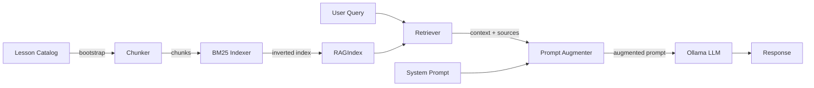

# RAG Pipeline

## Speed-optimized flow

1. **Bootstrap**: Catalog → chunker strips HTML, truncates to 300 chars, builds chunks.
2. **Indexing**: BM25 inverted index with stopword filtering (30 common Spanish words removed). Accent-stripped tokenization.
3. **Query**: Tokenized query scores against index. Top-2 results returned (minScore ≥ 0.15).
4. **Context budget**: Hard cap at ~100 tokens of context injected into prompt.
5. **Ollama**: `num_ctx=1024`, `num_predict=1024`, `flash_attn=true`, `num_gpu=999`, `top_k=10`, streaming enabled, model kept alive 30min.
